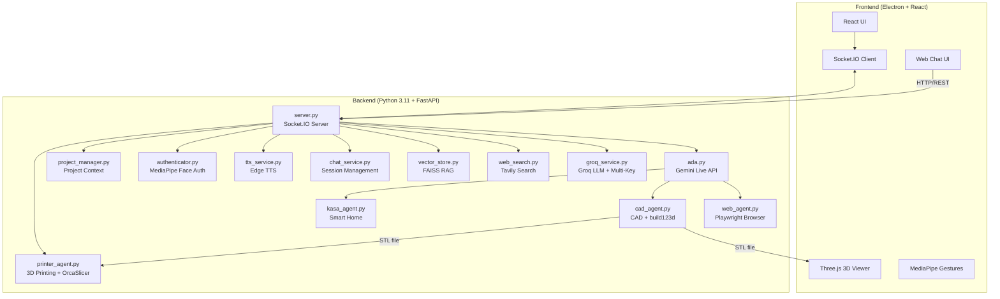

# A.D.A V2 - Advanced Design Assistant


> **A.D.A** = **A**dvanced **D**esign **A**ssistant

ADA V2 is a sophisticated AI assistant designed for multimodal interaction. It combines Google's Gemini 2.5 Native Audio with computer vision, gesture control, and 3D CAD generation in a Electron desktop application. Now with **ASTRO-style web chat** powered by Groq LLM!

---

## 🌟 Capabilities at a Glance

| Feature | Description | Technology |
|---------|-------------|------------|
| **🗣️ Low-Latency Voice** | Real-time conversation with interrupt handling | Gemini 2.5 Native Audio |
| **🌐 Web Chat** | ASTRO-style chat interface with Groq LLM | Groq Llama 3.3 + Tavily Search |
| **🔍 Web Search** | Real-time information via Tavily AI | Tavily API |
| **🧠 Learning System** | RAG-powered knowledge base | FAISS + Sentence Transformers |
| **💾 Session Memory** | Persistent conversation history | JSON file storage |
| **🔑 Multi-Key Rotation** | Fallback on rate limits | Multiple Groq API keys |
| **🔊 TTS Voice** | Text-to-speech output | Microsoft Edge TTS |
| **🗣️ Voice Input** | Speech recognition | Web Speech API |
| **🧊 Parametric CAD** | Editable 3D model generation from voice prompts | `build123d` → STL |
| **🖨️ 3D Printing** | Slicing and wireless print job submission | OrcaSlicer + Moonraker/OctoPrint |
| **🖐️ Minority Report UI** | Gesture-controlled window manipulation | MediaPipe Hand Tracking |
| **👁️ Face Authentication** | Secure local biometric login | MediaPipe Face Landmarker |
| **🌐 Web Agent** | Autonomous browser automation | Playwright + Chromium |
| **🏠 Smart Home** | Voice control for TP-Link Kasa devices | `python-kasa` |
| **📁 Project Memory** | Persistent context across sessions | File-based JSON storage |

---

## 🏗️ Architecture Overview



---

## 🚀 New: Web Chat Feature (ASTRO-Style)

ADA V2 now includes an **ASTRO-style web chat interface** powered by Groq LLM!

### Features:
- 🌐 **3 Chat Modes**: Auto (AI decides), General (no search), Web Search (Tavily)
- 🗣️ **Voice Input**: Click mic and speak
- 🔊 **TTS Output**: Enable speaker for voice responses
- 📊 **Activity Panel**: See AI decision-making process
- 🔍 **Search Results**: View sources in real-time
- 💾 **Session Memory**: Conversations persist across restarts
- 🎨 **Animated Orb**: WebGL background animation

### Quick Start with Web Chat:
```bash
# Install ASTRO dependencies
pip install -r backend/requirements_astro.txt

# Copy and configure .env
cp backend/.env.example backend/.env
# Add your GROQ_API_KEY and TAVILY_API_KEY

# Run the app
npm run dev

# Open web chat in browser
# http://localhost:5173 (when running dev server)
```

---

## ⚡ TL;DR Quick Start (Experienced Developers)

<details>
<summary>Click to expand quick setup commands</summary>

```bash
# 1. Clone and enter
git clone https://github.com/nazirlouis/ada_v2.git && cd ada_v2

# 2. Create Python environment (Python 3.11)
conda create -n ada_v2 python=3.11 -y && conda activate ada_v2
brew install portaudio  # macOS only (for PyAudio)
pip install -r requirements.txt

# 2b. Install ASTRO dependencies (optional - for web chat)
pip install -r backend/requirements_astro.txt

# 3. Setup frontend
npm install

# 4. Create .env file
echo "GEMINI_API_KEY=your_key_here" > .env

# Optional: Groq API for web chat
echo "GROQ_API_KEY=your_groq_key" >> .env
echo "TAVILY_API_KEY=your_tavily_key" >> .env

# 5. Run!
conda activate ada_v2 && npm run dev
```

</details>

---

## 🛠️ Installation Requirements

### 1. System Dependencies

**MacOS:**
```bash
# Audio Input/Output support (PyAudio)
brew install portaudio
```

**Windows:**
- No additional system dependencies required!

### 2. Python Environment

```bash
conda create -n ada_v2 python=3.11
conda activate ada_v2

# Install all dependencies
pip install -r requirements.txt

# Install ASTRO dependencies (for web chat)
pip install -r backend/requirements_astro.txt

# Install Playwright browsers
playwright install chromium
```

### 3. Frontend Setup

Requires **Node.js 18+** and **npm**.

```bash
npm install
```

### 4. API Keys Setup

#### Gemini API Key (for voice features)
1. Go to [Google AI Studio](https://aistudio.google.com/app/apikey)
2. Create API key
3. Add to `.env`: `GEMINI_API_KEY=your_key`

#### Groq API Key (for web chat)
1. Get free key at [console.groq.com](https://console.groq.com)
2. Add to `backend/.env`: `GROQ_API_KEY=your_key`

#### Tavily API Key (for web search)
1. Get free key at [tavily.com](https://tavily.com)
2. Add to `backend/.env`: `TAVILY_API_KEY=your_key`

### 5. 🔐 Face Authentication Setup

1. Take a photo of your face
2. Rename to `reference.jpg`
3. Place in `backend/` folder

### 6. 🖨️ 3D Printer Setup

Supported: Klipper/Moonraker, OctoPrint, PrusaLink

---

## ⚙️ Configuration

### settings.json
| Key | Type | Description |
| :--- | :--- | :--- |
| `face_auth_enabled` | `bool` | Face authentication on/off |
| `tool_permissions` | `obj` | Manual approval for tools |

### Environment Variables
| Variable | Description |
| :--- | :--- |
| `GEMINI_API_KEY` | Google Gemini API (voice features) |
| `GROQ_API_KEY` | Groq API (web chat) |
| `TAVILY_API_KEY` | Tavily API (web search) |
| `TTS_VOICE` | Edge TTS voice (default: en-GB-RyanNeural) |

---

## 🚀 Running ADA V2

### Option 1: Easy Way
```bash
conda activate ada_v2
npm run dev
```

### Option 2: Developer Way
**Terminal 1:**
```bash
conda activate ada_v2
python backend/server.py
```

**Terminal 2:**
```bash
npm run dev
```

---

## ✅ First Flight Checklist

1. **Voice**: Say "Hello Ada"
2. **Web Chat**: Click Globe icon for ASTRO-style chat
3. **CAD**: Say "Create a cube"
4. **Web Agent**: Say "Go to Google"
5. **Smart Home**: "Turn on the lights"

---

## 📂 Project Structure

```
ada_v2/
├── backend/                    # Python server & AI logic
│   ├── server.py               # FastAPI + Socket.IO server
│   ├── ada.py                 # Gemini Live API integration
│   ├── config_ada.py          # ASTRO configuration
│   ├── astro_integration.py   # Web chat endpoints
│   ├── services/
│   │   ├── groq_service.py    # Groq LLM + multi-key
│   │   ├── web_search.py     # Tavily search
│   │   ├── vector_store.py   # FAISS RAG
│   │   ├── chat_service.py   # Session management
│   │   └── tts_service.py   # Edge TTS
│   ├── cad_agent.py           # CAD generation
│   ├── printer_agent.py       # 3D printing
│   ├── web_agent.py          # Playwright automation
│   ├── kasa_agent.py         # Smart home
│   ├── authenticator.py       # Face auth
│   └── requirements_astro.txt # ASTRO dependencies
├── src/                       # React frontend
│   ├── App.jsx               # Main app + WebChatView
│   ├── web-chat.html         # Standalone web chat
│   ├── orb.js                # WebGL animated background
│   ├── style-astro.css       # Glass-morphism theme
│   └── components/           # UI components
├── database/                  # Learning data & sessions
│   ├── learning_data/        # .txt files for RAG
│   ├── chats_data/           # Session history
│   └── vector_store/         # FAISS index
├── electron/                  # Electron main process
├── .env                      # API keys
└── README.md
```

---

## ❓ Troubleshooting FAQ

### Web Chat not working
1. Ensure `GROQ_API_KEY` is set in `backend/.env`
2. Check backend logs for connection errors
3. Verify `requirements_astro.txt` are installed

### Voice not responding
1. Check microphone permissions
2. Ensure `GEMINI_API_KEY` is valid
3. Check console for errors

---

## 🤝 Contributing

1. **Fork** the repository
2. **Create branch**: `git checkout -b feature/amazing-feature`
3. **Commit**: `git commit -m 'Add amazing feature'`
4. **Push**: `git push origin feature/amazing-feature`
5. **Open Pull Request**

---

## 🙏 Acknowledgments

- **[Google Gemini](https://deepmind.google/technologies/gemini/)** — Native Audio API
- **[Groq](https://groq.com/)** — Fast LLM inference
- **[Tavily](https://tavily.com/)** — AI search
- **[build123d](https://github.com/gumyr/build123d)** — Parametric CAD
- **[MediaPipe](https://developers.google.com/mediapipe)** — Hand tracking & face auth
- **[Playwright](https://playwright.dev/)** — Browser automation
- **[Edge TTS](https://github.com/rany2/edge-tts)** — Text-to-speech

---

## 📄 License

MIT License - see [LICENSE](LICENSE) file.

---

<p align="center">
  <strong>Built with 🤖 by Nazir Louis</strong><br>
  <em>Bridging AI, CAD, and Vision in a Single Interface</em>
</p>
